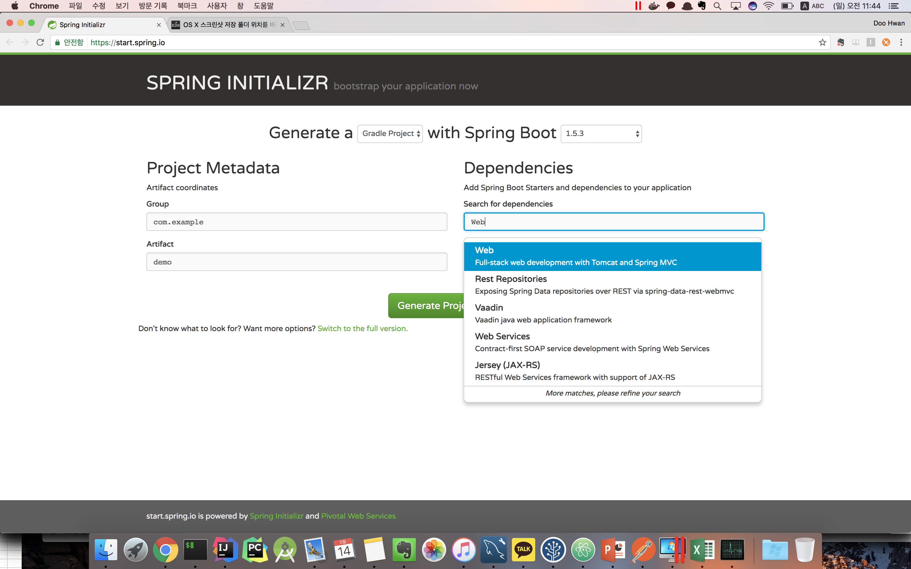
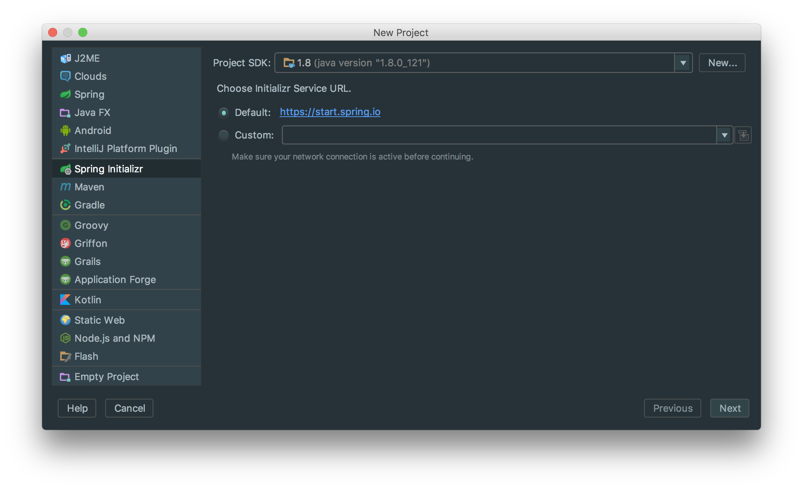
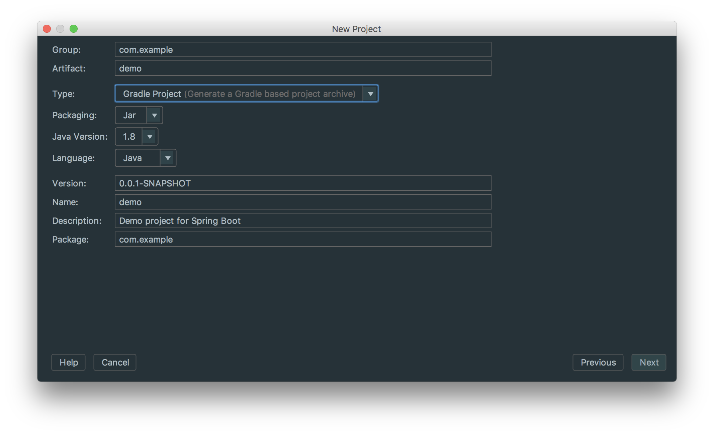
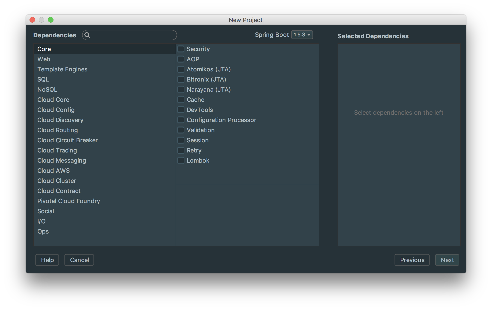
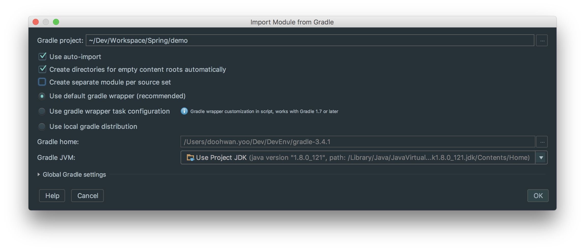
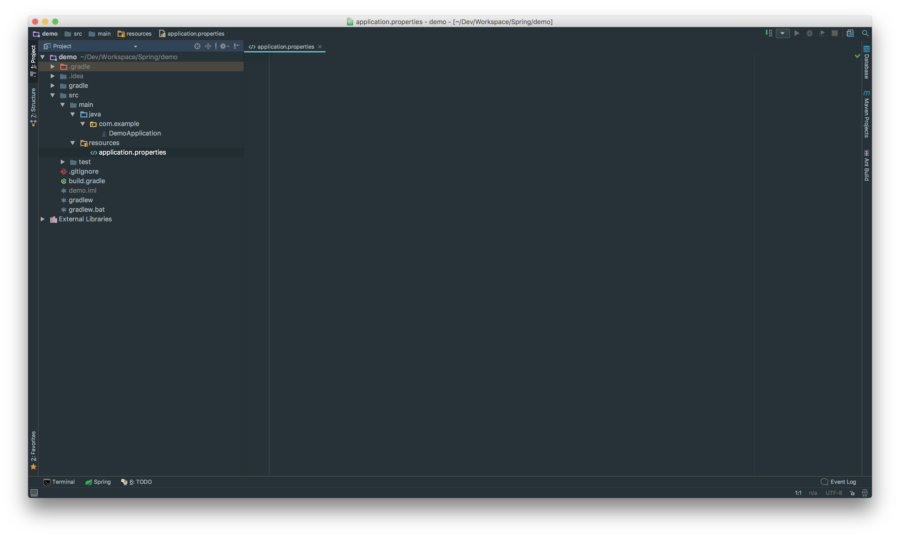
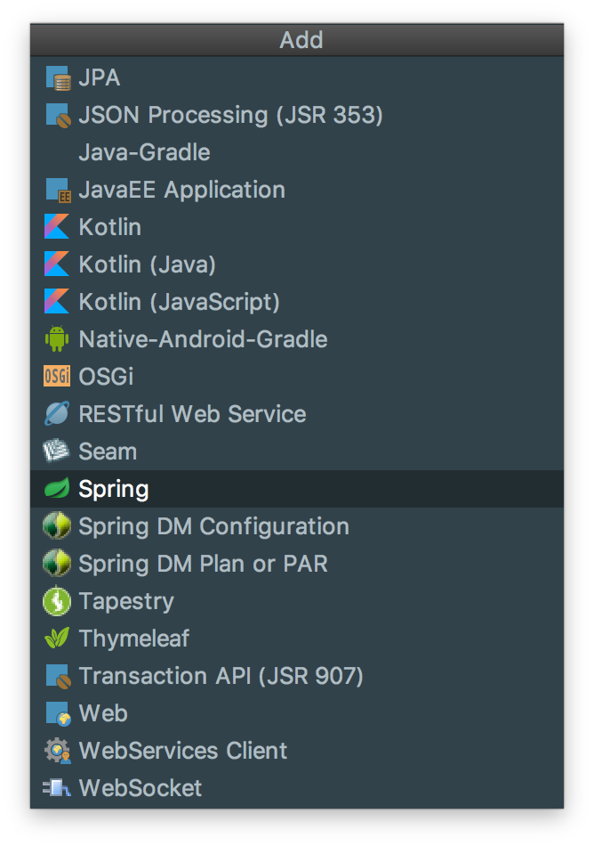
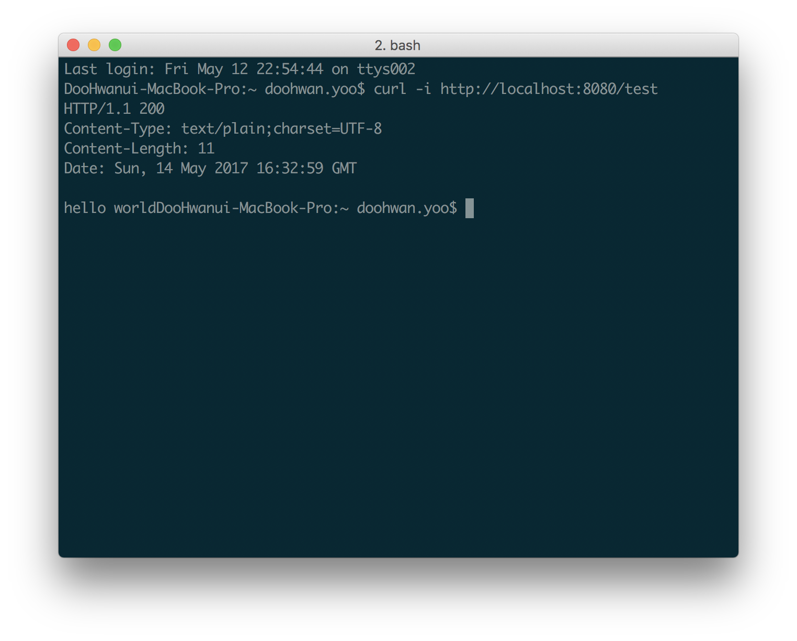

#### 관련글 전체 보기
Springboot 시작하기[1] - 기초 설정

[Springboot 시작하기[2] - 뷰를 연결하자 <thymeleaf, jsp>](https://doohwan-yoo.github.io/start-springboot-2/)

[Springboot에서 MyBatis 연동하기](https://doohwan-yoo.github.io/springboot-mybatis/)

### Springboot!!!
수 많은 XML 에서의 해방! Annotation 만으로의 간편한 설정! Spring 3.x 을 사용하다가 Springboot 를 처음 접했을 때 신선한 충격 그 자체였다. (현재는 여전히 버전업 이슈에 따른 고통들이 남아있지만..) Node.js와 Django에 비해 초심자들에게 접근하기 어려웠던 부분을 많이 해결 한 것을 보고 역시 기술은 정체되지 않는구나를 다시한번 깨닫게 해줬다.

### 시작하자
스프링부트를 시작하는 방법은 spring.io 사이트에서 springboot initializr 를 통해 기본 스켈레톤을 다운로드 받는 방법이 있다. 또한 Intellij 를 쓴다면 유료버전에서는 spring.io 와의 연결을 통해 자동으로 프로젝트를 생성해 준다.



위와 같이 [https://start.spring.io](https://start.spring.io) 를 통해서 생성할 수 있다. Gradle 과 Maven 프로젝트를 모두 제공해 주고, 기본적으로 미리 필요한 Dependency 들을 선언해서 프로젝트 내에 포함 시킬 수 있다.

intellij 의 경우는 다음과 같이 프로젝트를 생성할 수 있다.


유료버전에서는 언급한 것과 같이 Spring initializr 가 포함되어 있다.


프로젝트의 기본 정보를 설정하고


필요한 라이브러리들을 미리 선택하는 기능을 제공한다


Auto Import 기능을 활성화 시키고 각 소스셋마다 모듈화 시키는 것은 해제하도록 하자. (이 부분은 몇몇 호환성 부분에서 문제가 될 수 있다. 예로 Querydsl에서 generated 되는 소스들은 모듈화가 되서는 안된다)


기본적으로 위와 같은 계층의 프로젝트가 생성이 되었다. 선택되어있는 application.properties 는 기존의 스프링에서 괴롭게 했던 xml 설정들을 많은 부분 대체 시켜주는 역할을 한다. 필자는 properties 보다는 최근에 각광받고 있는 yalm 설정을 선호함으로 application.properties 를 삭제하고 application.yml 로 파일을 대체하도록 하겠다.

```java
@SpringBootApplication
public class DemoApplication {

	public static void main(String[] args) {
		SpringApplication.run(DemoApplication.class, args);
	}
}

```
여기까지 왔다면 이제 시작할 준비가 된 것이다.
DemoApplication.java 를 한번 살펴보자 `SpringBootApplication` 어노테이션이 자동으로 여러분의 설정들이 잘 세팅되도록 도와준다. `ComponentScan` 의 경우는 이전 스프링에서 basepackage 를 스캔할 수 있도록 XML 에서 설정하였던 것과 동일 한 역할을 한다.

추가적으로 intellij에서 현프로젝트가 스프링 프로젝트 인 것을 인식할 수 있도록 모듈 설정 (맥의 경우 `command+;`)를 눌러 Module 에서 아래와 같이 Spring 을 추가해 주도록 한다



자 이제 간단한 restapi를 하나 만들어 보도록 하자.

```java
@SpringBootApplication
@ComponentScan(basePackages = "com.example.demo")
@RestController
public class DemoApplication {

	public static void main(String[] args) {
		SpringApplication.run(DemoApplication.class, args);
	}

	@RequestMapping(value = "/test", method = RequestMethod.GET)
	public @ResponseBody String test() {
		return "hello world";
	}
}

```

상단에 `@RestController` 의 선언과 하단의 `@RequestMapping` 선언을 통해 Hello world 를 보내주는 예제를 만들었다.



잘 출력된다.

어떠한가? 설정의 꼬임이 없다면 Node.js 에서 Express 를 사용하여 api 하나 만드는 것과 다르지 않는 빠른 속도를 보여준다. 이전의 Spring 이였다면 어떠했을 지는 이제는 상상도 하기 어렵다.

다음에는 springboot를 사용하여 페이지를 생성하여 연결하는 부분을 살펴보도록 하겠다
