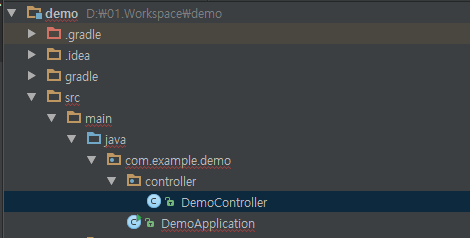
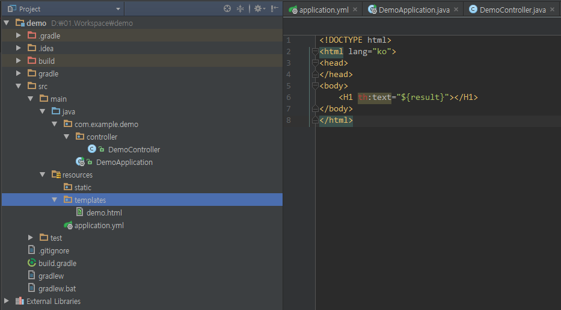
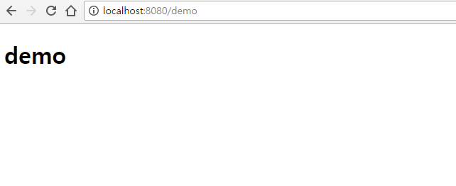
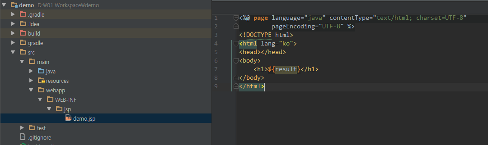

#### 관련글 전체 보기
[Springboot 시작하기[1] - 기초 설정](https://doohwan-yoo.github.io/start-springboot-1/)

Springboot 시작하기[2] - 뷰를 연결하자 <thymeleaf, jsp>

[Springboot에서 MyBatis 연동하기](https://doohwan-yoo.github.io/springboot-mybatis/)


### 뷰를 연결해보자
Springboot 에서 View 를 연결하는 방법은 다음과 같다.
- thymeleaf
- jsp
- velocity

필자는 thymeleaf 와 jsp 만 사용해 봤으므로 이 두 가지만 다루도록 하겠다

### thymeleaf 연결하기
어떻게 발음해야 하는지 도통 감이 오지 않는다. 사용해본지 1년이 넘었는데 이것을 설명할때면 어물쩡 넘어가곤 한다. 제대로 발음하는 법을 아시는 분은 제보 바랍니다. 어찌 되었든 현재 Spring 진영에서 강력하게 밀고 있는 template 엔진이다.

먼저 이전 예제에 이어서 스프링에서 자주 쓰는 구조인 Controller 를 만들어 보자



위와 같이 DemoController 를 만들었다.

build.gradle 에 다음을 추가 한다.

```java
compile('org.springframework.boot:spring-boot-starter-thymeleaf')
```

이제 Controller에 RequestMapping을 통하여 URL 을 하나 연결한다.

```java
@Controller
public class DemoController {

    @RequestMapping(value = "/demo", method= RequestMethod.GET)
    public String demo(Model model) {

        model.addAttribute("result", "demo");
        return "demo";
    }
}
```

여기서 model 은 view 로 넘겨 줄 값이고, `return "demo"` 는 페이지의 이름이다.


좌측에 보이는 것처럼 `resources/templates` 폴더에 파일을 하나 만든다. 만들어진 파일에는 우측의 내용을 작성한다. 작성 된 html을 보면 `th:text` 로 시작하는 곳이 thymeleaf template engine 에 문법이다 자세한 사용법은 아래 링크로 가면 확인 할 수 있다.

[http://www.thymeleaf.org/doc/tutorials/3.0/thymeleafspring.html](http://www.thymeleaf.org/doc/tutorials/3.0/thymeleafspring.html)


thymeleaf의 문서를 보면 아래와 같이 templates 폴더로 view 의 prefix 와 .html 의 suffix를 자동으로 생성하는 Bean을 thymeleaf 라이브러리가 포함하는 것을 알 수 있다.

```java
@Bean
public SpringResourceTemplateResolver templateResolver(){
    // SpringResourceTemplateResolver automatically integrates with Spring's own
    // resource resolution infrastructure, which is highly recommended.
    SpringResourceTemplateResolver templateResolver = new SpringResourceTemplateResolver();
    templateResolver.setApplicationContext(this.applicationContext);
    templateResolver.setPrefix("/WEB-INF/templates/");
    templateResolver.setSuffix(".html");
    // HTML is the default value, added here for the sake of clarity.
    templateResolver.setTemplateMode(TemplateMode.HTML);
    // Template cache is true by default. Set to false if you want
    // templates to be automatically updated when modified.
    templateResolver.setCacheable(true);
    return templateResolver;
}
```

자 정상적으로 해당 페이지가 보이면 완성 된 것이다. 정말 쉽다!!



### JSP 연결하기
JSP 는 사실 springboot 로 넘어오면서 spring 진영으로부터 외면 받고 있는 느낌이 든다. 별도의 추가 설정을 해 줘야 한다.

먼저 다음의 추가 설정을 build.gradle 에 한다.

```java
dependencies {
	...
	compile('org.apache.tomcat.embed:tomcat-embed-jasper')
	compile('javax.servlet:jstl:1.2')
	...
}
```
위의 라이브러리 추가는 jsp와 jstl 을 사용할 수 있게 해준다.

`application.yml` 에도 다음의 설정을 한다.

```yml
spring:
  mvc:
    view:
      prefix: /WEB-INF/jsp/
      suffix: .jsp
```

이제부터 잘 봐야 하는데



좌측에 보이는 것처럼 `main/webapp/WEB-INF/jsp` 폴더를 생성하고 그 아래 작성할 jsp 파일들을 위치 시킨다.

이제 실행해 보면


아까와 같은 페이지가 뜬다면 성공이다!~

추가로 Springboot에서 embed 톰캣이 버전 8 이상일 경우 Spring security 에서 remember me 설정을 할 때 익스플로어에서 정상동작을 하지 않는 문제가 있다. 이 부분은 tomcat은 해당 표준을 정상적으로 준수하는데 브라우저가 준수하지 않는 경우로서 별도 설정을 통해 해결할 수 있다. 이 부분은 추 후에 별도의 게시글로 다시 설명 하려고 한다.

여기까지 뷰 연결 부분을 마치고, 다음은 mybatis 연동에 대해 알아보고자 한다.
