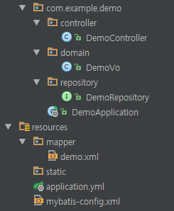
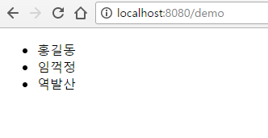

#### 관련글 전체 보기
[Springboot 시작하기[1] - 기초 설정](https://doohwan-yoo.github.io/start-springboot-1/)

[Springboot 시작하기[2] - 뷰를 연결하자 <thymeleaf, jsp>](https://doohwan-yoo.github.io/start-springboot-2/)

Springboot에서 MyBatis 연동하기

### MyBatis란?
Mybatis 사이트에서는 이렇게 설명한다. "마이바티스는 개발자가 지정한 SQL, 저장프로시저 그리고 몇가지 고급 매핑을 지원하는 퍼시스턴스 프레임워크이다". 쉽게 말하면 개발자가 데이터베이스의 여러 기능들을 쉽게 처리할 수 있게 해주는 프레임워크라고 할 수 있을 것 같다. 어찌되었든 국내에서는 여전히 hibernate 보다 많이 쓰이고 있는 프레임워크이다. 필자가 생각하는 hibernate 를 비롯한 orm 대비 장점은 편히 DB에서 쿼리를 실행하듯 쿼리문을 생성하는 것이다.

### DB 설정

먼저 DB 접속을 위해 간단하게 DB와 테이블을 생성해 보자. mysql 을 테스트용 DB로 선택했다고 가정하고 진행해보겠다.

```java
mysql> create database demo;
Query OK, 1 row affected (0.00 sec)

mysql> grant all privileges on demo.* to demo@'localhost' identified by 'demo1!';
Query OK, 0 rows affected (0.00 sec)

mysql> flush privileges;
Query OK, 0 rows affected (0.00 sec)
```

demo DB를 만들고 demo 유저에게 권한을 주었다.

table도 하나 생성해 보자
```java
CREATE TABLE `demo`.`tbl_demo` (
  `seq` INT NOT NULL auto_increment,
  `user_name` VARCHAR(45) NOT NULL,
  PRIMARY KEY (`seq`));


```

간단하게 테스트 하기위해 시퀀스와 사용자 이름을 받는 demo table을 생성했다.

강제로 데이터도 입력해 본다
```java
INSERT INTO tbl_demo(user_name) values('홍길동'),('임꺽정'),('역발산');
```

### MyBatis 설정
build.gradle 에 다음을 추가해서 DB 연결과 mybatis 를 연결할 수 있도록 한다.
```java
compile('org.mybatis.spring.boot:mybatis-spring-boot-starter:1.1.1') // MyBatis 라이브러리
compile('mysql:mysql-connector-java') // DB 연결 JDBC Library
```

먼저 앞에서 생성한 DB 와 연결하기 위해서 `applicaton.yml` 에 다음을 추가한다.

```yml
spring:
  datasource:
    type: org.apache.tomcat.jdbc.pool.DataSource
    driverClassName: com.mysql.jdbc.Driver
    url: jdbc:mysql://localhost:3306/demo?autoReconnect=true&useSSL=false
    username: demo
    password: demo1!
```

MyBatis 설정을 위해서 `resources/mybatis-config.xml` 파일을 하나 생성한다.

```xml
<?xml version="1.0" encoding="UTF-8" ?>
<!DOCTYPE configuration
        PUBLIC "-//mybatis.org//DTD Config 3.0//EN"
        "http://mybatis.org/dtd/mybatis-3-config.dtd">
<configuration>
    <typeAliases>
        <package name="com.example.demo.domain"/>
    </typeAliases>
    <mappers>
        <mapper resource="mapper/demo.xml"/>
    </mappers>
</configuration>
```

typeAliases 아래에 `<package name="com.example.demo.domain"/>` 부분은 MyBatis 에 전달하거나 결과를 받을 Vo 객체가 있을 패키지를 알려준다. 해당 패키지 아래 위치할 class 들은 자동으로 Mybatis 에서 alias 를 만들어 준다.

mappers 아래 `mapper` 부분은 실제 SQL 문을 작성할 xml 이 위치할 곳을 가리킨다. 여기서는 `resource/mapper` 에 폴더를 만들어 해당 파일을 위치시켰다.

전체 구조는 다음과 같다.



이제 값을 전달 받을 Vo 객체를 하나 생성하자 이름은 DemoVo.class 로 하였다.

```java
public class DemoVo {
    private Long seq;
    private String user_name;

    public Long getSeq() {
        return seq;
    }

    public void setSeq(Long seq) {
        this.seq = seq;
    }

    public String getUser_name() {
        return user_name;
    }

    public void setUser_name(String user_name) {
        this.user_name = user_name;
    }
}
```
앞서 생성한 DB 와 동일한 타입을 갖고 있는 변수와 Getter, Setter 를 만들었다. Getter, Setter 는 lombok 으로 대체해도 무방하다.

이제 실제 쿼리를 작성할 xml 을 생성해 보자. `resources/mapper/demo.xml`을 만들었다.

```xml
<?xml version="1.0" encoding="UTF-8"?>
<!DOCTYPE mapper PUBLIC "-//mybatis.org//DTD Mapper 3.0//EN" "http://mybatis.org/dtd/mybatis-3-mapper.dtd">

<mapper namespace="com.example.demo.repository.DemoRepository">

    <select id="getUserList" resultType="DemoVo">
        SELECT * FROM tbl_demo
    </select>


</mapper>
```
`<mapper namespace="com.example.demo.repository.DemoRepository">` 부분은 해당 xml 의 쿼리와 이 쿼리에 접근할 수 있는 객체와 Mapping 을 할 수 있게 도와준다. 그 아래는 위에서 생성한 DemoVo 를 결과 값으로 받는 쿼리문이다. Mybatis 의 자세한 사용법은 다른 예제들도 많으니 찾아보기 바란다. 또한 추가로 Vo, HashMap, DTO 중 어느 것을 사용할 것인가 하는 해묵은 논쟁은 여기서는 배제하기로 한다.
(dao, mapper, repository 등에 용어 혼선이 있을수도 있다. 적절하게 용도에 맞게 이름을 지어주셔도 무방하다. 큰 의미를 부여하지 말자)

그럼 DemoRepository 를 보자.
```java

@Mapper
@Repository
public interface DemoRepository {
    List<DemoVo> getUserList();
}
```
@Mapper 어노테이션으로 xml 과 연결을 할 수 있도록 해주고, @Repository 어노테이션으로 Service나 Controller 에서 DI 될 수 있도록 한다.
나머지는 `demo.xml` 에 있는 id와 동일한 함수 명을 만들어 실행 한다면 이전의 생성한 쿼리문의 결과를 얻어올 수 있다.

이전 게시글에서 작성한 코드에 더해서 Controller 에 다음을 추가하자.

```java
@Controller
public class DemoController {

    @Autowired
    private DemoRepository demoRepository;

    @RequestMapping(value = "/demo", method= RequestMethod.GET)
    public String demo(Model model) {


        model.addAttribute("result", demoRepository.getUserList());
        return "demo";
    }
}
```
해당 소스는 demo url 에서 데이터베이스의 연결하여 결과 값을 view 로 전달해 줄 수 있도록 했다.

이제 페이지에서 결과값을 처리해 보자. (이전 게시글에 마지막 view resolver 가 jsp라 jstl로 처리하였다)

```html
<%@ page language="java" contentType="text/html; charset=UTF-8"
         pageEncoding="UTF-8" %>
<%@ taglib uri="http://java.sun.com/jsp/jstl/core" prefix="c" %>
<!DOCTYPE html>
<html lang="ko">
<head></head>
<body>
    <ul>
    <c:forEach var="item" items="${result}">
        <li>${item.user_name}</li>
    </c:forEach>
    </ul>
</body>
</html>
```

결과는?



짜잔~~ 성공적으로 화면에 출력되는 것을 볼 수 있다.

MyBatis 는 이렇게 설정하여 직관적으로 작성할 수 있는 장점이 있다.
부족하게 설명한 부분들은 트랜잭션 처리나, 여러 DB를 연결하는 방법등이 있지만, 최근 프로젝트를 jpa 를 사용해서 하는 고로.. skip 하기로 했다.
다음은 국내에서 mybatis와 비교하여 많은 논쟁이 되었던 JPA(Hibernate) 특히 Springboot 에 data-jpa 를 시작해볼 예정이다.
