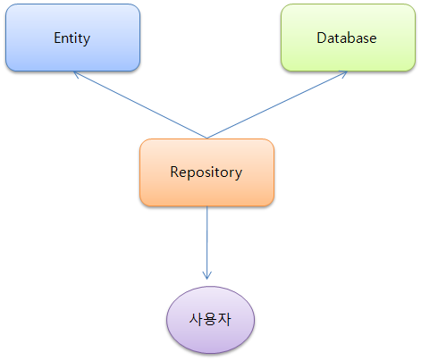
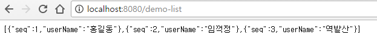
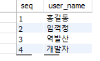

#### 관련글 전체 보기
[Springboot 에서 DATA-JPA(Hibernate) 사용하기[1] - 기초 설정](https://doohwan-yoo.github.io/data-jpa-1/)

Springboot 에서 DATA-JPA(Hibernate) 사용하기[2] - Entity, Repository, CRUD

[Springboot 에서 DATA-JPA(Hibernate) 사용하기[3] - JOIN](https://doohwan-yoo.github.io/data-jpa-3/)

### 기본 구조



기본 구조는 위와 같다. 간단히 설명하자면 data-jpa 라이브러리에서 내부적인 로직으로 Repository 가 Entity(도메인 객체) 와 Database 를 Mapping 시켜서 사용자가 사용할 수 있도록 해준다.

### Entity 를 만들자

지난번 Mybatis 게시글에서 만들었던 table을 연결 시킬 domain class를 하나 만들자.
안보신 분들을 위하여 다시 설명하자면 지난 번 table은 다음과 같이 생성했었다.

```java
CREATE TABLE `tbl_demo` (
  `seq` int(11) NOT NULL AUTO_INCREMENT,
  `user_name` varchar(45) NOT NULL,
  PRIMARY KEY (`seq`)
) ENGINE=InnoDB AUTO_INCREMENT=4 DEFAULT CHARSET=utf8;

```

Domain class는 다음과 같다.

```java
@Entity
@Table(name = "tbl_demo", schema = "demo")
public class Demo {

    @Id
    @GeneratedValue(strategy= GenerationType.IDENTITY)
    @Column(name = "seq", updatable = false, nullable = false)
    private Long seq;

    @Column(name = "user_name", nullable = false)
    private String userName;

    public Long getSeq() {
        return seq;
    }

    public void setSeq(Long seq) {
        this.seq = seq;
    }

    public String getUserName() {
        return userName;
    }

    public void setUserName(String userName) {
        this.userName = userName;
    }
}
```

@Entity annotation 으로 해당 class가 database 와 mapping 될 것을 선언한다.
@Table 은 Mapping 할 database 에 table 을 명시적으로 적어준다.
@Id 는 해당 테이블에 ID, @GenerateValue 는 ID 값을 생성할 로직을 말해준다.
여기서는 auto_increment 형식의 ID를 만들었고 UUID 및 여러 형태의 generator 들을 제공해 준다.
@Column annotation 으로 해당 컬럼의 구체적인 설정과 실제 컬럼명과 변수명을 다르게 설정할 수 있도록 하였다.

더 많은 지원들이 있는데 이 부분은 [https://docs.spring.io/spring-data/jpa/docs/current/reference/html/](https://docs.spring.io/spring-data/jpa/docs/current/reference/html/) 에서 확인할 수 있다.


### Repository를 생성하자
여기까지 생성하였으면 이제 Repository interface를 만들어 보자.
```java
@Repository
public interface DemoJpaRepository extends JpaRepository<Demo, Long> {
}
```

자 이렇게 빈 interface 를 하나 생성했다.
`JpaRepository<Demo, Long>` 은 연결할 Entity 와 그 Entity 의 id 형을 넣어준다.

### 테스트1 - 목록 가져오기

이제 이렇게 만든 Entity 와 Repository 를 사용하여 테스트를 해보자.

다음과 같이 Controller를 만든다. (유닛테스트를 해도 무방하다)

```java
@Autowired
private DemoJpaRepository demoJpaRepository;

@RequestMapping(value = "/demo-list", method = RequestMethod.GET)
public @ResponseBody List<Demo> demoJpaList() {
    return demoJpaRepository.findAll();
}
```

이제 해당 URL 로 접근해보자.



정상적으로 나온다. 그런데 findAll 이라는 나는 선언도 혹은 구현체도 만들지 않았는데도 database 에 있는 목록에 결과를 받았다. 그렇다 해당 함수는 data-jpa 에서 기본적으로 제공해 준다.

### 테스트2 - 아이디 값으로 data 가져오기

자 그럼 id 로 database 에 값은 어떻게 읽을 수 있을까?

Repository 에 다음을 추가하자
```java
@Repository
public interface DemoJpaRepository extends JpaRepository<Demo, Long> {
    Demo findBySeq(Long id);
}
```

Controller 에 하나를 더 추가하자.

```java
@RequestMapping(value = "/demo-detail/{id}", method = RequestMethod.GET)
  public @ResponseBody Demo demoJpaDetail(@PathVariable Long id) {
      return demoJpaRepository.findBySeq(id);
  }
```

자 호출을 해 보자.


잘 나온다. 이번에는 인터페이스 구현만으로 값을 가져올 수 있었다. find 뒤에 붙는 여러 형태들로 다양한 쿼리를 실행할 수 있다. 예를 들어서 이런형태도 가능하다.
`findBySeqAndUserName(Long id, String name)`, `findBySeqOrderBy....`

편하지 않은가? (물론 이것만으로는 부족하다)


### 테스트3 - 값을 저장하기

이번에는 Springboot 에서 제공하는 테스트로 값을 database 에 저장해 보도록 하겠다.

다음과 같이 단위 테스트 모듈을 하나 만들자
```java
@Autowired
DemoJpaRepository demoJpaRepository;

@Test
public void jpaCreate() {
	Demo demo = new Demo();
	demo.setUserName("개발자");

	demoJpaRepository.save(demo);

}
```

결과는? 보시다시피 잘 들어가 있다.



save 함수를 통한 값의 저장 이외에도 count, delete 등을 지원하여 crud 에 대한 편의성을 제공한다.

### 다음은?

이렇게 편해 보이지만 복잡한 쿼리문 등은 순수하게 위에 기술한 방법으로만은 할 수 없다.
그래서 다음은 조금 더 복잡하게 Entity 와의 관계를 설정해 보도록 하겠다. 그리고 이 후에는 Querydsl에 대해 알아보도록 하겠다
