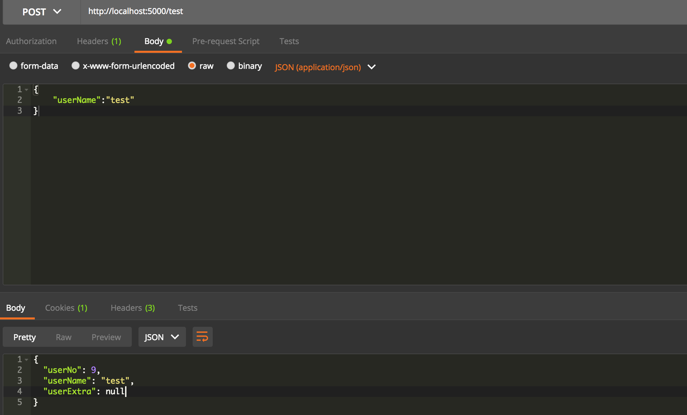
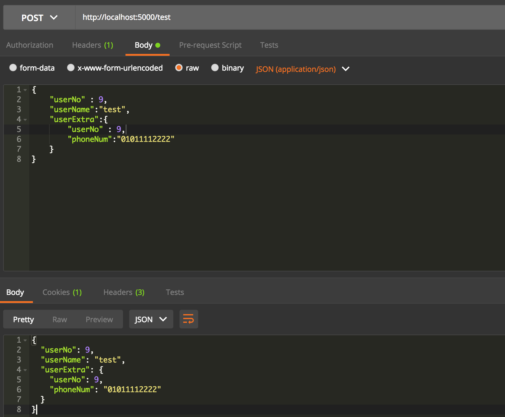
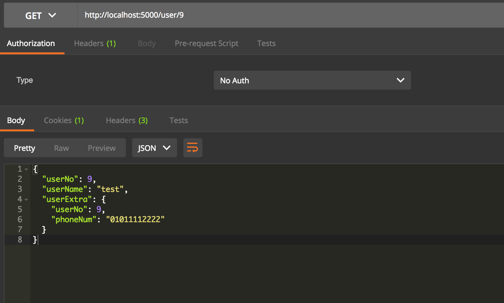

#### 관련글 전체 보기
[Springboot 에서 DATA-JPA(Hibernate) 사용하기[1] - 기초 설정](https://doohwan-yoo.github.io/data-jpa-1/)

[Springboot 에서 DATA-JPA(Hibernate) 사용하기[2] - Entity, Repository, CRUD](https://doohwan-yoo.github.io/data-jpa-2/)

Springboot 에서 DATA-JPA(Hibernate) 사용하기[3] - JOIN

[Springboot 에서 Querydsl 사용하기](https://doohwan-yoo.github.io/querydsl/)

### 샘플

지금부터 설명하는 것들에 대한 샘플은
[https://github.com/doohwan-yoo/jpa-sample](https://github.com/doohwan-yoo/jpa-sample) 에서 확인할 수 있다

### 테이블 만들기
지난 시간에 얘기했던 것처럼 JPA 를 사용해서 여러 테이블에 관계를 맺도록 해볼려고 한다.

먼저 간단한 구조를 가지는 테이블 두개를 만들어 보자

```java
CREATE TABLE `tbl_user` (
  `user_no` int(10) unsigned NOT NULL AUTO_INCREMENT,
  `user_name` varchar(45) NOT NULL,
  PRIMARY KEY (`user_no`)
) ENGINE=InnoDB AUTO_INCREMENT=10 DEFAULT CHARSET=utf8;

CREATE TABLE `tbl_user_extra` (
  `user_no` int(10) unsigned NOT NULL,
  `phone_num` varchar(11) NOT NULL,
  KEY `fk_user_extra_01_idx` (`user_no`),
  CONSTRAINT `fk_user_extra_01` FOREIGN KEY (`user_no`) REFERENCES `tbl_user` (`user_no`) ON DELETE NO ACTION ON UPDATE NO ACTION
) ENGINE=InnoDB DEFAULT CHARSET=utf8;

```

첫번 째 테이블은 사용자 번호(PK)와 사용자 이름을 갖고, 두번 째 테이블은 사용자 번호(FK) 와 전화번호를 갖는 테이블을 구성 했다.

### Entity 설정

위에 설정한 테이블과 맵핑이 될 테이블을 만들자
```java
@Entity
@Table(name = "tbl_user")
public class User extends BaseUser{

    @Id
    @GeneratedValue(strategy= GenerationType.IDENTITY)
    @Column(name = "user_no", updatable = false, insertable = false)
    private Integer userNo;

    @Column(name = "user_name")
    private String userName;

    public Integer getUserNo() {
        return userNo;
    }

    public void setUserNo(Integer userNo) {
        this.userNo = userNo;
    }
    public String getUserName() {
        return userName;
    }

    public void setUserName(String userName) {
        this.userName = userName;
    }

    // @OneToOne(fetch = FetchType.LAZY, cascade={CascadeType.ALL})
    @OneToOne(cascade={CascadeType.ALL})
    @JoinColumn(name="user_no", insertable = false)
    private UserExtra userExtra;

    public UserExtra getUserExtra() {
        return userExtra;
    }

    public void setUserExtra(UserExtra userExtra) {
        this.userExtra = userExtra;
    }
}
```

첫번 째 테이블이다. 사용자 번호 컬럼은 auto_increment 가 동작하도록 GenerateValue 를 설정해 주었다.
여기부터 핵심 인데, 하단에 UserExtra 테이블과 관계를 설정하도록 하였는데 1:1 에 관계를 설정했다. @OneToMany @ManyToOne 과 같이 여러 형태의 Annotation 을 지원한다. `cascade` 속성은 update 나 delete 시 하위 테이블도 함께 수정 되도록 하는 역할을 한다.

```java
@Entity
@Table(name = "tbl_user_extra")
public class UserExtra {

    @Id
    @Column(name = "user_no")
    private Integer userNo;

    @Column(name = "phone_num")
    private String phoneNum;


    public Integer getUserNo() {
        return userNo;
    }

    public void setUserNo(Integer userNo) {
        this.userNo = userNo;
    }

    public String getPhoneNum() {
        return phoneNum;
    }

    public void setPhoneNum(String phoneNum) {
        this.phoneNum = phoneNum;
    }
}
```
두번째 테이블이다. 이전 글을 봤다면 잘 이해가 갈 것이다.

### Repository 만들고 데이터 입력하기

해당 Entity 를 맵핑하고 CRUD 동작을 위해서 다음의 Repository interface 를 생성했다.

```java
public interface UserRepository extends JpaRepository<User, Integer> {
}

```
그리고 Repository 를 사용할 Service 를 하나 만들고 저장 및 업데이트 하도록 했다.

```java
@Service
public class DemoService {

    private UserRepository userRepository;

    public DemoService(UserRepository userRepository) {
        this.userRepository = userRepository;
    }

    @Transactional
    public User userSaveAndUpdate(User input) {
        return userRepository.save(input);
    }
}
```
그리고 테스트 할 Controller 도 하나 만들어 주었다.

```java
@RequestMapping(value="/test", method = RequestMethod.POST)
    public @ResponseBody
    User test(@RequestBody User input) {

        return demoService.userSaveAndUpdate(input);
    }
```

이제 테스트를 위해 Postman 을 이용해 봤다. (유닛 테스트를 해도 무관 하다)



성공적으로 저장이 이뤄졌다.
같은 url로 업데이트도 가능한데 여기서 부터 흥미로운 점이 있다.
아래와 같이 User Entity 의 구조대로 JSON 리퀘스트를 보내면



이렇게!, user table 은 업데이트를 하고, user_extra 테이블은 insert를 하게 된다. 물론 기존에 데이터가 있다면 update 동작을 하게 된다. 얼마나 간편하게 동작을 하는가!! 예전에 처음으로 이러한 동작을 봤을 때 우워~~ 를 연발했었다.

### Join 된 테이블 가져오기

이제 넣은 데이터를 가져와 보자. 그렇게 하기 위해서 Service 에서 기본키인 userNo로 데이터를 얻어오는 getUser 함수 하나를 만들었다.

```java
@Service
public class DemoService {

    private UserRepository userRepository;

    public DemoService(UserRepository userRepository) {
        this.userRepository = userRepository;
    }

    @Transactional
    public User userSaveAndUpdate(User input) {
        return userRepository.save(input);
    }

    public User getUser(Integer id) {
        return userRepository.findOne(id);
    }
}
```

Controller 도 만들어준다. Controller 는 Restful 한 형식으로 만들었다.

```java
@RequestMapping(value="/user/{id}", method = RequestMethod.GET)
    public @ResponseBody
    User getUser(@PathVariable Integer id) {

        return demoService.getUser(id);
    }
```

이제 결과를 한번 보자.



User 객체에 대한 요청만 했는데, 그 안에 Join된 UserExtra 도 함께 얻어온다.

여기서 눈여겨 볼 점이 하나 있는데 Hibernate 가 Query를 수행하는 방식이다
쿼리를 어떻게 가져왔는지 보자

```java
select
  user0_.user_no as user_no1_0_0_,
  user0_.user_name as user_nam2_0_0_,
  userextra1_.user_no as user_no1_1_1_,
  userextra1_.phone_num as phone_nu2_1_1_
from
  tbl_user user0_ left outer join
  tbl_user_extra userextra1_
on
  user0_.user_no=userextra1_.user_no
where
  user0_.user_no=?
```

위에 보는 것과 같이 User 에 대해서 요청을 하자마자 연관된 객체에 대해서 join 동작을 수행해서 가져왔다. 이러한 방식을 hibernate 에서는 (Eager 방식이라고 한다)

그렇다면 다른 방식도 있을까? User Entity 를 다시 한번 보자

```java
    @OneToOne(fetch = FetchType.LAZY, cascade={CascadeType.ALL})
    @JoinColumn(name="user_no", insertable = false)
    private UserExtra userExtra;
```

관계를 설정 하는 부분에 FetchType 을 Lazy 로 해보자. 그런 다음 다시 요청을 해보자.

결과는?
```java
Hibernate: select user0_.user_no as user_no1_0_0_, user0_.user_name as user_nam2_0_0_ from tbl_user user0_ where user0_.user_no=?

Hibernate: select userextra0_.user_no as user_no1_1_0_, userextra0_.phone_num as phone_nu2_1_0_ from tbl_user_extra userextra0_ where userextra0_.user_no=?
```
위와 같이 Join 을 수행하는 것이 아니라. 각 table 에 대해서 두번의 질의를 요청한다. 그렇다면 비효율 적인 것이 아니냐? 라는 의문을 가질 수 있는데 실제로 두번째 쿼리가 호출 될 때는 UserExtra 객체에 대해서 직접 데이터를 요청할 때이다. 예를 들어 보겠다

```java
public User getUser(Integer id) {
    User user = userRepository.findOne(id);
    logger.debug("사용자 번호 : " + user.getUserNo());
    return null;
}
```

위와 같이 User 안에 UserExtra 객체에 대해서 호출이 일어나지 않는다면 두번째 쿼리는 실행디지 않는다.

```java
public User getUser(Integer id) {
    User user = userRepository.findOne(id);
    logger.debug("사용자 번호 : " + user.getUserNo());
    logger.debug("이 순간 쿼리 실행 : " + user.getUserExtra().getPhoneNum());
    return null;
}
```

Eager 에 경우 불필요한 조인이 매번 일어날 수 있다. Lazy의 경우는 그러한 것을 방지해 준다. Eager에 경우 N+1 쿼리 실행에 문제도 있다. 언관 구조를 잘 보고 Fetch 계획을 세우는 것이 중요하다.

여기까지 data-jpa 기본 연재를 마치겠다. 다음은 Querydsl 에 대해 준비해 보도록 할까 한다.
