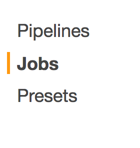
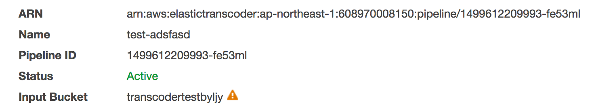

### Elastic Transcoder 에 동작방식
업무가 최근 동영상 변환을 해야 하기 때문에 2달전에 Elastic Transcoder 를 이용해서 작업을 해 봤다. 현재는 Dedicate 식 버전인 AWS Elemental 을 사용하고 있지만, 일반 회사에서 많지 않은 영상을 변환하고자 한다면 Transcoder 도 유용할 것이라 생각 되어 포스팅을 남긴다.

Transcoder의 동작 방식은 다음의 형태를 띈다.


위와 같이 원본 파일과 변화할 형식의 미리 정의 된 프리셋을 조합하여 하나의 작업을 만들고, 작업을 진행하는 파이프라인에 순차적으로 넣어서 원하는 결과물을 얻는 구조이다.

### AWS 콘솔에서 시작하기
아쉽게도 현재 한국 리전에서는 해당 서비스를 이용할 수 없다.
가까운 도쿄 리전에서 테스트를 해보자.



Elastic Transcoder 서비스에 들어가면 위와 같은 메뉴를 볼 수 있다. 파이프라인은 우리가 만든 작업들이 실행 될 메인이고, Preset 은 미리 정의된 인코딩 코덱들이다. 커스터마이징 가능한 코덱은 여기서 만들 수 있다. Job 은 말 그대로 우리가 변활할 파일을 이용하여 실행시킬 작업이다.

먼저 파이프라인을 만들어 보자.


pipeline name : 본인이 사용할 고유 이름 <br>
input bucket : Elastic Transcoder 는 S3에 저장된 원본 데이터를 사용하여 변환작업을 수행한다. 여기는 원본이 위치한 버킷명을 지정한다 <br>
output bucket : 다음은 원본이 변환되어 저장 될 버킷이름을 지정한다. <br>
Thumbnail bucket : 작업에서 썸네일이 생성된다면 저장될 버킷을 지정한다.

위와 같이 작성하고 생성을 하면 다음과 같은 내용들이 보일 것이다.



여기서 중요한 것은 Pipeline ID 이다. 우리가 사용할 파이프라인의 고유 아이디이고 나중에 SDK 를 이용하여 실행할 때 목적지 주소로 쓰인다.


이곳은 프리셋 화면이다. AWS 에서는 미리 다양한 프리셋을 준비해놓았다. 여기서 원하는 프리셋이 없다면 Create New Preset 으로 본인한테 적당한 프리셋을 생성하면 된다.

여기서 봐두어야 할 것은 ID 부분이다. 아래에서 AWS SDK 를 이용한다면 직접 생성하거나 만들어진 프리셋을 가져와야 할 텐데 여기의 ID 가 필요하다.


이제 위의 사항들을 토대로 JOB 을 생성 할 수 있다. Pipeline 에는 위에서 생성한 pipeline 을 입력하고, 출력할 파일의 Prefix 와 원본의 위치 출력본의 위치 및 출력시 사용할 프리셋등을 연결하면 작업을 실행할 수 있다.

좀더 자세한 사항들이 있지만 기본적인 구조는 위와 같으므로 이쯤으로 하기로 하고 이제 해당 부분을 Nodejs 에서 어떻게 처리하는지 보겠다.

### Nodejs 에서 Elastic Transcoder 사용하기

```npm
npm install aws-sdk --save
```
먼저 aws에서 지원하는 sdk 를 사용하기 위해서 위에 명령어를 콘솔에서 실행한다.


```java
let aws = require('aws-sdk');
aws.config.update({
    accessKeyId: process.env.AWS_ACCESS_KEY_ID,
    secretAccessKey: process.env.AWS_SECRET_KEY
});
```

기본적으로 aws 서비스에 접근하기 위해서 미리 계정에서 생성했던 accessKeyId 와 secretAccessKey 를 지정해 준다.

이제 작업을 만들기 위해 작업에 필요한 정보들을 생성해 보도록 하겠다.

```javascript
let param = {
    PipelineId: process.env.TRANSCODER_PIPELINE_ID,
    Input: {
        Key: originBucket
    },
    Outputs: [
        {
            Key: path + '/1M',
            PresetId: '1351620000001-200030', // hls 1M
            SegmentDuration: '5'
        },
        {
            Key: path + '/2M',
            PresetId: '1491218647964-qhrv2s', // hls 2M
            SegmentDuration: '5'
        },
        {
            Key: path + '/1080p.mp4',
            PresetId: '1351620000001-000001', // generic 1080p
        },
        {
            Key: path + '/720p.mp4',
            PresetId: '1351620000001-000010', // generic 720p
        },
        {
            Key: path + '/480p.mp4',
            PresetId: '1351620000001-000020', // generic 480p
        }
    ],
    OutputKeyPrefix : process.env.S3_OUTPUT_DIR,
    Playlists: [
        {
            Name: path + '/playlist',
            Format: 'HLSv3',
            OutputKeys: [path + '/600k', path + '/1M', path + '/2M']
        }
    ]
};
```

앞에서 AWS Console 에서 생성했던 것과 비슷한 유형의 값들이 보일 것이다. PipelineId 에는 미리 생성했던 Pipeline ID 를 Input에서 원본파일을, Outputs 에서는 출력될 결과물의 위치와 프리셋 ID를 넣어준다. OutputKeyPrefix 는 결과 물에 항상 앞에 붙어나올 Prefix 이다. Playlists는 HLS 형식의 라이브스트리밍 결과물일 경우 각 해상도 별 결과물의 playlist 를 만들기 위한 요소이다.

위와 같이 선언하고 작업을 시작시켜보자.

```javascript
//트랜스코더를 생성하고
let elastictranscoder = new aws.ElasticTranscoder();

//위에서 생성한 정보들로 작업을 생성한다.
elastictranscoder.createJob(param, function (err, data) {

    if(err) {
      throw(err);
    }
    else {
      //실행시킨 작업에 대환 결과를 받기 위해서 대기를 하는 콜벡 펑션이다.
      elastictranscoder.waitFor('jobComplete', {Id : data['Job']['Id']}, function(err, data) {
        //작업이 끝난 결과
      }
    }
}
```

간단하다. 트랜스코더를 생성하고, 위에서 생성한 정보들로 작업을 실행시키고 그 결과를 수신하기 위해 waitFor 로 대기한다.

여기까지 간단한 Elastic transcoder의 콘솔 및 nodejs 를 통한 사용법을 알아봤다.

추가로 알아두어야 할 것은 Transcoder 의 대한 과금은 영상의 길이이다. 결코 저렴한 금액은 아니다. 또한 편하게 쓸 수 있는 만큼 동영상에 대한 세세한 설정을 하기가 힘들다. 결론적으로 한국 리전에 서비스를 하지 않고 있어서, 도쿄에서 한다면 더 많은 비용 소모와 네트워크 트래픽 비용까지 소모하게 된다.

만약 한국에서 대량의 영상 서비스를 준비하고 있는 회사라면 AWS Elemental 을 이용하시길 추천드린다. Elemental 의 경우 과금 방식이 조금 더 효율적이고, 지원또한 훌륭하다.

아무쪼록 도움이 되길 바라며 더 궁금하신 사항은 이메일이나 댓글로 남겨주십시오~~
