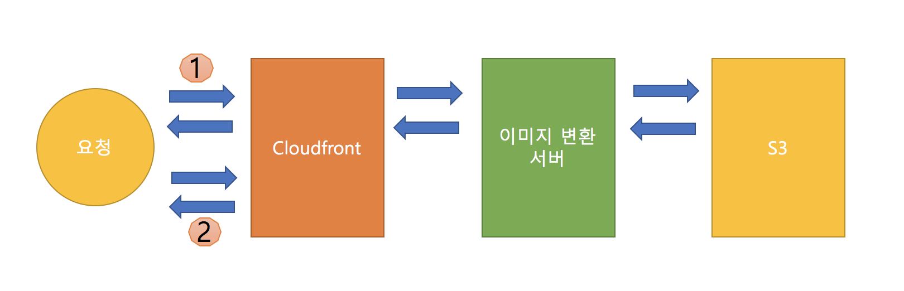
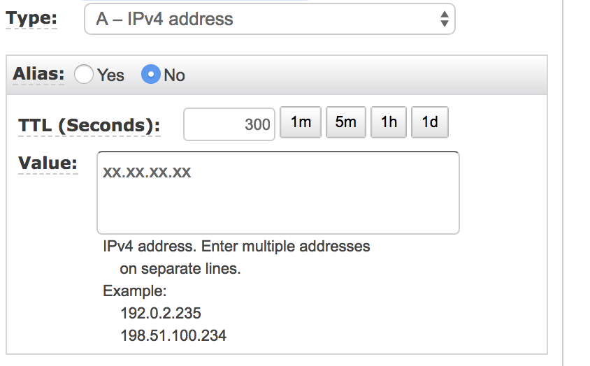
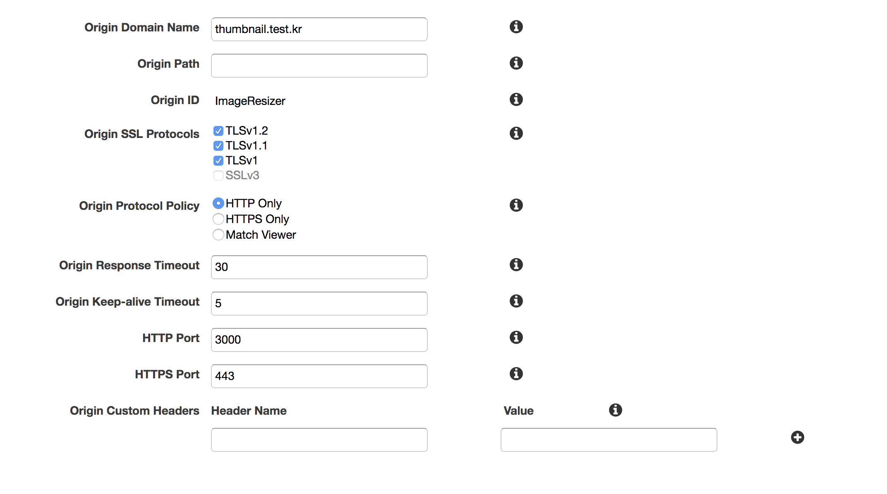

### Why? 동적 이미지 리사이징
현재 만들고 있는 회사 서비스는 음악 영상 관련 서비스라 썸네일이 많이 필요했다. 앨범, 곡, 아티스트 들의 이미지가 모두 다르고 또한 보여지는 곳 에서의 크기도 제각각이였다.
물론 CMS 에서 운영자가 보는 이미지도 같은 이미지지만 크기가 달랐다. 이러다 보니 미리 이미지의 크기를 특정 지을 수 없었고, 모바일 어플리케이션의 최적화를 위한 테스트를 위해서도
동적인 이미지를 만들 필요가 있었다.

동적 이미지 리사이징이 무엇인지 간단히 설명하자면 멜론에서 이미지들을 한번 보자

[http://cdnimg.melon.co.kr/svc/images/main/imgUrl20171027062234.jpg/melon/resize/100/quality/80](http://cdnimg.melon.co.kr/svc/images/main/imgUrl20171027062234.jpg/melon/resize/100/quality/80)

위의 URL 에서 resize 와 quality 뒤에 숫자들을 변경해 보면 이미지가 원하는 크기와 퀄리티로 출력되는 것을 볼 수 있다.

이렇게 동적으로 변화하는 이미지를 제공해 주는 것이 목표라고 한다면 문제가 되는 것은 매번 이미지를 리사이징 하는데서 오는 비용 소모와 속도다. 이것을 해결 해 주기 위해 사용하는 것이 CDN 이다. 다행이도 요즘 많은 CDN 들이 정적 컨테츠 뿐만이 아니라 동적 캐싱까지 지원해 주기 때문에 쉽게 해결할 수 있었다.

전체적인 설계는 다음과 같다.



1번의 최초의 요청에 대해서는 리사이징 서버에서 S3 로 원본 데이터를 요청하고, Cloudfront를 통해 사용자에게 전송하고 캐싱한다. 2번 요청에서는 1번에서 캐싱 된 데이터를 넘겨주게 되어 무리 없이 사용자가 사용할 수 있게 된다.

### 이미지 리사이징 서버를 만들자

이미지 리사이징 서버는 샘플로 Nodejs 를 사용하였다. IO 를 많이 쓰니 멀티쓰레딩이 지원되는 서버를 사용하면 성능향상에 도움이 될 것으로 보인다. Nodejs 로 서버를 띄울때는 클러스터 모드로 띄어 손실을 줄였다.

이미지 리사이징은 imagemagik 보다 성능이 좋다는 gimp 를 사용했다.

s3 에서 원본을 요청하고 해당 원본 스트림으로 바로 resizing 요청 후 클라이언트에 전송하여 불필요한 파일 저장을 하지 않도록 구현하였다.

```javascript
let express = require('express');
let router = express.Router();
let Jimp = require('jimp');
let AWS = require('aws-sdk');
let logger = require('../config/logger');
let stream = require('stream');
AWS.config.update({
    accessKeyId: process.env.AWS_ACCESS_KEY_ID,
    secretAccessKey: process.env.AWS_SECRET_KEY,
});

router.get('/resize/:target/:id/:filename', async (req, res) => {

    try {
        logger.debug('resize : ' + req.params.target + '/' + req.params.id + '/' + req.params.filename);
        let data = await downloadFile(req.params.target + '/' + req.params.id + '/' + req.params.filename);
        let result = await resizeImage(data.Body, Number(req.query.size === null || req.query.size===undefined ? 1280 : req.query.size), Number(req.query.quality === null || req.query.quality > 100 || req.query.quality===undefined ? 100 : req.query.quality));

        res.setHeader('Content-Length', result.contentLength);
        res.setHeader('Content-Type', result.contentType);

        result.bufferStream.pipe(res);

    } catch(err) {
        console.log("err : " + JSON.stringify(err));
        res.sendStatus(500);
    }
});

let downloadFile = (key) => new Promise((resolve, reject) => {

    let s3 = new AWS.S3();

    let options = {
        Bucket: process.env.BUCKET,
        Key: key
    };

    try {
        s3.getObject(options, function (err, data) {
            if (err) {
                logger.error('[ERROR] get S3 Object:' + err + ':' + key);
                reject(err);
            } else {
                resolve(data);
            }
        });
    } catch(err) {
        reject(err);
    }
});

let resizeImage = (buffer, size, quality) => new Promise((resolve, reject) => {

    Jimp.read(buffer, function (err, image) {
        if(err || image === null) {
            logger.error('[ERROR] read buffer :' + err + ':image');
            reject();
        } else {
            image.resize(size, Jimp.AUTO).quality(quality).getBuffer(image.getMIME(), function (err, buffer) {

                logger.debug("resize complete");

                let bufferStream = new stream.PassThrough();
                bufferStream.end(buffer);

                resolve({
                    contentType : image.getMIME(),
                    contentLength: buffer.length,
                    bufferStream : bufferStream
                });
            });
        }
    });
});

module.exports = router;

```

### Route53 설정 및 서버 연결
동적 리사이징을 하기 위해서는 Cloudfront 가 도메인을 필요로 하기 때문에 (혹은 Loadbalancer<LB>) Route53 에서 도메인을 생성하여 연결하여야 한다.



위와 같이 적절하게 도메인을 앞에서 생성한 서버와 연결하자.

### Cloudfront 설정하기

Cloudfront 에서 Web 유형으로 CDN 을 하나 생성하자.



Origin 설정에서 위와 같이 앞에서 설정한 도메인을 연결해 준다

또한 앞으로 우리가 요청할 url을 어떻게 생성할지 모르지만 Query String 을 사용하고자 한다면


위와 같이 쿼리 스트링도 전달되도록 Behavior 설정을 변경한다.

모든 설정이 끝났다.
이제 Cloudfront 에서 제공해주는 Endpoint 로 접근을 하면 최초에는 서버에서 실행을 그 다음에는 서버를 거치지 않고 Cloudfront 에서 캐싱된 데이터를 넘겨 줄 것이다.

### 그렇다면 성능은?
성능을 AWS Spot Instance 로 여러 테스트를 해봤다.
apache ab 테스트를 진행하였고 8 core 에 경우 이미지 처리를 초당 10건 정도(1280px 기준) 뿐이 못했었다. 32 core cpu 에서 nodejs cluster 32 개를 띄우고 테스트 하였을 시 초당 1000건 이상 처리하는 놀라운 성능을 확인했다.

문제는 비싸서 잘 쓰지 못한다는 것...

이것에 대안으로 회사 서비스가 사용자가 올리는 이미지보다는 내부 컨텐츠의 이미지가 대다수를 차지하기 때문에 최초 이미지가 올라갈 시 강제로 로드를 한번 하여 캐싱을 해 주고, 캐싱 주기를 길게 늘려주는 것으로 해결을 했다.

금전적 여유나 서비스 유형이 우리와 비슷하다면 도입해 볼만 하다고 생각한다.

보안 자료들이 있어서 디테일 하게 설명 못해서 죄송합니다~
궁금하신 점은 질문 부탁드려요
